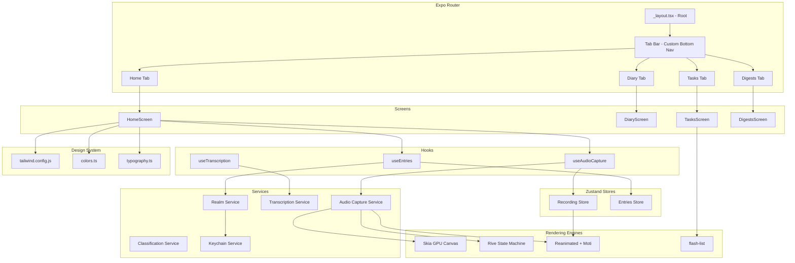

<!-- generated-by: gsd-doc-writer -->

# Architecture

## System Overview

Dear Diary is a local-first mobile application for "Record and Forget" voice capture. Users tap a single button to record their thoughts, which are processed entirely on-device through speech-to-text and automatically classified into Diary entries, Tasks, or Reference Notes -- with zero cloud dependencies and full offline reliability. The app is built on **React Native's New Architecture** (Fabric, JSI, TurboModules) via **Expo CNG (Continuous Native Generation / Prebuild)**, targeting both iOS and Android. The architectural style is **layered with service isolation**: a thin screen layer delegates to hooks, which orchestrate pure services (audio capture, transcription, classification, persistence), while Zustand stores hold transient UI state. Everything below the screen layer is agnostic of the rendering framework.

## Component Diagram

The following Mermaid diagram shows the major modules, their relationships, and data flow direction:



## Data Flow

A typical capture session follows this path through the system:

1. **Record** -- User taps the record button on HomeScreen. The useAudioCapture hook initiates the AudioCaptureService, which starts streaming audio from the device microphone. Simultaneously, the RecordingStore updates transient state (recording duration, amplitude level). The Skia waveform visualization renders amplitude data on a GPU canvas, and the Rive mic icon morphs into an equalizer animation.

2. **Stop** -- User taps again to stop. Audio capture ends. The raw audio file is a temporary in-memory buffer -- it is not persisted to disk long-term. Haptic feedback fires via expo-haptics.

3. **Transcribe** -- The TranscriptionService receives the audio buffer and passes it to react-native-whisper (on-device speech-to-text). Transcription runs on a native worker thread, returning transcribed text. Progress is reported through the RecordingStore for UI feedback.

4. **Classify** -- The ClassificationService analyzes the transcribed text on-device using a small NLP model (Executorch + SmolLM2) with a keyword heuristic fallback. It labels the entry as Diary, Task, or Note.

5. **Persist** -- The RealmService writes the entry (text, classification, timestamp, metadata) to the encrypted Realm database. Encryption keys are managed by react-native-keychain (iOS Keychain / Android Keystore) with fast KV storage via react-native-mmkv. The raw audio buffer is discarded -- audio is ephemeral, only text persists.

6. **Render** -- The EntriesStore picks up the new entry via Realm change listeners. The flash-list on DiaryScreen re-renders with the new entry. Moti animations provide a staggered entry reveal.

7. **Browse** -- Users navigate tabs to view entries filtered by type. Search and filtering run against Realm's deterministic single-key index on timestamp and category -- returning results in under 10ms.

## Key Abstractions

| Abstraction | Description | File Location |
|---|---|---|
| RootLayout | Expo Router root layout -- loads fonts (Nunito, Fredoka, Playfair Display, JetBrains Mono) and manages SplashScreen lifecycle | src/app/_layout.tsx |
| TabLayout | Custom bottom tab bar with Solar SVG icons, border-4 styling, and pink skew underline indicator | src/app/(tabs)/_layout.tsx |
| Screens (Home, Diary, Tasks, Digests) | Thin screen components that compose hooks and primitives -- target max 150 lines each | src/screens/*.tsx |
| useAudioCapture | Hook orchestrating microphone, Skia visualization, Rive state machine, and haptics | src/hooks/useAudioCapture.ts |
| useTranscription | Hook bridging audio buffer to Whisper STT with stage-based progress reporting and pending replay | src/hooks/useTranscription.ts |
| useEntries | Hook providing Realm query results to screens with reactive updates | src/hooks/useEntries.ts |
| Realm Entry Schema | Realm object schema for encrypted persistence with deterministic indexing on timestamp and category | src/models/EntryRealm.ts |
| Recording Store (Zustand) | Transient state for live recording -- non-reactive variables bypass React tree to avoid redraws | src/stores/recordingStore.ts |
| Entries Store (Zustand) | UI-facing state for entry list, search queries, and filter selections | src/stores/entriesStore.ts |
| Theme tokens | Design system constants consumed by both Tailwind classes and runtime code | theme/colors.ts, theme/typography.ts, theme/tailwind.config.js |
| Solar Icon constants | Inline SVG XML strings for Solar icon set, rendered via react-native-svg SvgXml | src/assets/icons/solar.ts |

## Directory Structure Rationale

```
src/
  app/              Expo Router file-based pages -- defines navigation routes
                    and layout hierarchy. Must NOT contain barrel exports
                    (index.ts) as they break file-based routing.
  screens/          Thin screen components that wire hooks and compose UI
                    primitives. Each screen maps to a route tab.
  components/       Reusable UI primitives -- receive props, render UI,
                    no direct service calls or Zustand stores.
  services/         Pure business logic modules -- no JSX, no React imports.
                    Accept parameters, return promises.
  stores/           Zustand store slices -- one slice per domain (recording,
                    entries). Transient non-reactive variables live outside
                    the store for live transcription to avoid redraws.
  hooks/            Custom hooks that bridge services and stores to React
                    components.
  utils/            Pure utility functions -- date formatting, string
                    manipulation, validation.
  types/            Shared TypeScript types, interfaces, and Zod runtime
                    validation schemas.
  assets/
    fonts/          Bundled TTF font files loaded by expo-font at startup.
    icons/          Solar SVG icon set exported as inline XML strings
                    for react-native-svg SvgXml rendering.
  tests/            Unit and integration test files mirroring source
                    structure.

theme/              Design system foundation -- Tailwind config extends
                    NativeWind v4 presets; colors.ts and typography.ts
                    provide runtime-accessible constants for imperative
                    animations and service layers.

ui-export-react/    Reference component library exported from the design
                    tool (Sleek). Used as visual specification during
                    screen implementation -- not imported by the app.
```

The project follows a **layered, convention-over-configuration** layout where each directory has a clear responsibility: screens are thin, components are dumb, services are pure, and hooks are the bridge. Empty directories (services/, stores/, hooks/, utils/, types/, components/ui/) are scaffolding placeholders for implementation in future phases. The theme/ directory is separate from src/ because it is consumed by both runtime code (via TypeScript imports) and build-time tooling (via tailwind.config.js).