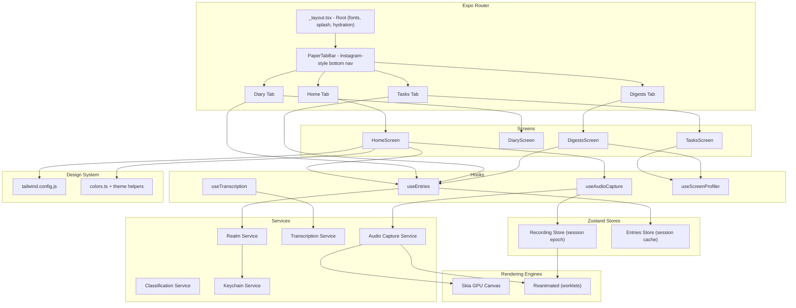

<!-- generated-by: gsd-doc-writer -->
# Architecture

## System Overview

Dear Diary is a local-first mobile application for "Record and Forget" voice capture. Users tap a single button to record their thoughts, which are processed entirely on-device through speech-to-text and automatically classified into Diary entries, Tasks, or Reference Notes -- with zero cloud dependencies and full offline reliability. The app is built on **React Native's New Architecture** (Fabric, JSI, TurboModules) via **Expo CNG (Continuous Native Generation / Prebuild)**, targeting both iOS and Android. The architectural style is **layered with service isolation**: a thin screen layer delegates to hooks, which orchestrate pure services (audio capture, transcription, classification, persistence), while Zustand stores hold transient UI state.

## Component Diagram

The following Mermaid diagram shows the major modules, their relationships, and data flow direction:



## Data Flow

A typical capture session follows this path through the system:

1. **Record** -- User taps the record button on HomeScreen. The useAudioCapture hook initiates the AudioCaptureService, which starts streaming audio from the device microphone. Simultaneously, the RecordingStore updates transient state (recording duration, amplitude level, metering). Each `setRecording(true)` bumps the store's **session epoch**, so stale async completions from a previous session can never overwrite the live one.

2. **Stop** -- User taps again to stop. Audio capture ends and the file URI is marked pending processing together with its session id. Haptic feedback fires via expo-haptics. Interruptions (calls, backgrounding) pause/resume the actual recorder through the AudioCaptureService, mirrored in the store.

3. **Transcribe** -- The TranscriptionService passes the audio file to react-native-whisper (on-device speech-to-text) and reports progress stages through the RecordingStore. Cleanup at the end deletes **only the recording's own file** -- the service's temp path may already belong to a newer recording.

4. **Classify** -- The ClassificationService analyzes the transcribed text on-device (keyword heuristics) and labels the entry as Diary, Task, or Note.

5. **Persist** -- The RealmService (encrypted) writes the entry. The shared EntriesStore is updated via `addPersistedEntry` so Home previews and the store-driven triggers update immediately. Raw audio is discarded -- audio is ephemeral, only text persists.

6. **Sync & replay** -- On failure the URI stays pending so a later replay can retry; concurrent replay triggers (mount, AppState resume, background task) are deduped per URI. On cold start the root layout hydrates the EntriesStore from Realm so Home previews are correct; wipes and deletes invalidate the cache explicitly.

7. **Browse** -- Screens pull from Realm through `useEntries` on mount and on the store's first-entry trigger; search is debounced with staleness guards; day-group labels recompute on locale switch.

## Key Abstractions

| Abstraction | Description | File Location |
|---|---|---|
| RootLayout | Expo Router root layout -- loads fonts (Nunito, Fredoka, Playfair Display, JetBrains Mono), manages SplashScreen lifecycle, hydrates the entries store, renders a recoverable error view on font failure | src/app/_layout.tsx |
| TabLayout + PaperTabBar | Instagram-style flat bottom nav: full-bleed surface, 1px hairline, icon-only items, active tab in foreground color. Normal-flow layout element (no absolute positioning/blur) for native reliability | src/app/(tabs)/_layout.tsx, src/components/ui/PaperTabBar.tsx |
| useTabBarClearance | Safe-area-aware bottom padding so scroll content clears the nav bar on any device | src/hooks/useTabBarClearance.ts |
| Screens (Home, Diary, Tasks, Digests) | Thin screen components composing hooks and primitives; each is a ScrollView with keyboard handling and overlay modals as absolute siblings | src/screens/*.tsx |
| useAudioCapture | Hook orchestrating the recorder, session-guarded store writes, haptics, and shake-to-discard | src/hooks/useAudioCapture.ts |
| useTranscription | Hook bridging audio files to Whisper STT with stage progress, per-URI session ownership, pending replay with dedup, and retry-able failures | src/hooks/useTranscription.ts |
| useScreenProfiler | Seeds a Shopify performance-profiler flow per screen before its PerformanceMeasureView mounts (the app_boot flow only covers the first screen) | src/hooks/useScreenProfiler.ts |
| useEntries | Hook pulling Realm entries per screen with debounced search, wipe/delete cache invalidation, and locale-aware grouping | src/hooks/useEntries.ts |
| Realm Entry Schema | Realm object schema for encrypted persistence with deterministic indexing on timestamp and category | src/models/EntryRealm.ts |
| Recording Store (Zustand) | Transient state for live recording, including the session epoch that guards stale async writes | src/stores/recordingStore.ts |
| Entries Store (Zustand) | Session cache of recent entries (prepend-order) hydrated from Realm; drives Home previews and per-screen reload triggers | src/stores/entriesStore.ts |
| Theme tokens | Design system constants consumed by both Tailwind classes and runtime code; WCAG-verified pairs, per-theme dark variants, and themed helper functions for imperative colors | theme/colors.ts, theme/tailwind.config.js, global.css |
| Solar Icon constants | Inline SVG XML strings for Solar icon set, rendered via react-native-svg SvgXml | src/assets/icons/solar.ts |

## Directory Structure Rationale

```
src/
  app/              Expo Router file-based pages -- defines navigation routes
                    and layout hierarchy. Must NOT contain barrel exports
                    (index.ts) as they break file-based routing.
  screens/          Thin screen components that wire hooks and compose UI
                    primitives. Each screen maps to a route tab.
  components/       Reusable UI primitives -- receive props, render UI,
                    no direct service calls or Zustand stores.
  services/         Business logic modules -- no JSX, no React imports.
                    Accept parameters, return promises.
  stores/           Zustand store slices -- one slice per domain (recording,
                    entries).
  hooks/            Custom hooks that bridge services and stores to React
                    components.
  utils/            Pure utility functions -- date formatting, string
                    manipulation, validation.
  types/            Shared TypeScript types.
  assets/
    fonts/          Bundled TTF font files loaded by expo-font at startup.
    icons/          Solar SVG icon set exported as inline XML strings
                    for react-native-svg SvgXml rendering.
    images/         Bundled raster assets (spark illustration).
  tests/            Unit and integration test files mirroring source
                    structure.

theme/              Design system foundation -- Tailwind config extends
                    NativeWind v4 presets; colors.ts provides runtime-
                    accessible constants and themed helpers.

patches/            patch-package patches (applied automatically via the
                    postinstall script) for third-party packages that need
                    fixes until upstream releases them.
```

The project follows a **layered, convention-over-configuration** layout where each directory has a clear responsibility: screens are thin, components are dumb, services are pure, and hooks are the bridge. The theme/ directory is separate from src/ because it is consumed by both runtime code (via TypeScript imports) and build-time tooling (via tailwind.config.js).

## Known Native-Specific Notes

- **Floating/absolute bottom bars misrender inside the custom tabBar slot on Android** (shifted/oversized). PaperTabBar is deliberately a normal-flow flex child of the navigator column -- the scene shrinks to sit above it and the bar spans the screen by construction.
- **Reanimated style arrays must not reference `StyleSheet`-created (frozen) objects** -- reanimated 4's style processing mutates them and throws ("set key `current` on frozen object"). Animated styles in this codebase use inline literal objects only.
- **Native init for @shopify/react-native-performance** (`ReactNativePerformance.onAppStarted()`) lives in `MainActivity.onCreate()` -- because `android/` is gitignored, re-apply it after `npx expo prebuild`.
- **Metro delta cache can go stale**; after heavy edits, restart with `npx expo start --clear` so devices receive a full rebundle.
